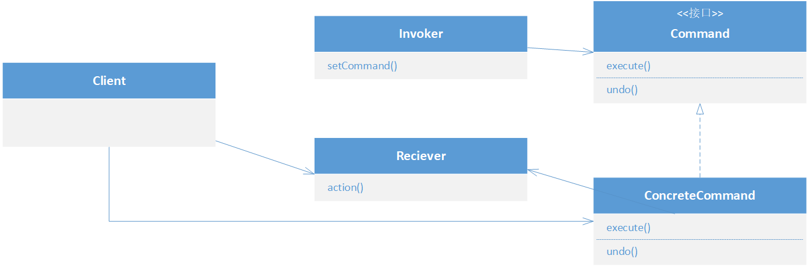

# 命令模式

## 含义

**将请求封装成对象**, 以便使用不同的请求,队列或日志来参数化其他对象, 命令模式支持可撤销的操作

命令对象通过在特定接收者上绑定动作来封装一个请求, 即*命令对象将动作和接收者包装进对象中*, 并且此对象只有一个公开的`execute()`方法, 调用此方法接收者就会执行动作, 代码中的体现就是:

```java
// 创建命令接口
public interface Command {
    public void execute();
}

// 一个具体的命令
public class ConcreteCommand implements Command {
	
    Reciever reciever;
    
    public ConcreteCommand(Reciever reciever){
        this.reciever = reciever;
    }
    
    public void execute(){
        // 执行动作
        reciever.action();
    }
}

// 一个接收者
public class Reciever {
    public void action();
}

// 调用者
public class Invoker {
    Command command;
    
    public void setCommand(Command command) {
        this.command = command;
    }
}

// Main函数中
{
    ConcreteCommand command = new ConcreteCommand(reciper);
    
    // 命令传递给调用者
    invoker.setCommand(command);
}
```

## 类图



- Client: 

  创建命令对象, 并将其加载到Invoker中, 每个命令对象都封装了摸个Reciever的一个动作

- Invoker:

  管理一组命令对象, 间接造成该命令的execute()方法被调用

- Command:

  所有的命令都实现这个接口, 此接口包含一个execute()方法, 封装了Invoker的一组动作
