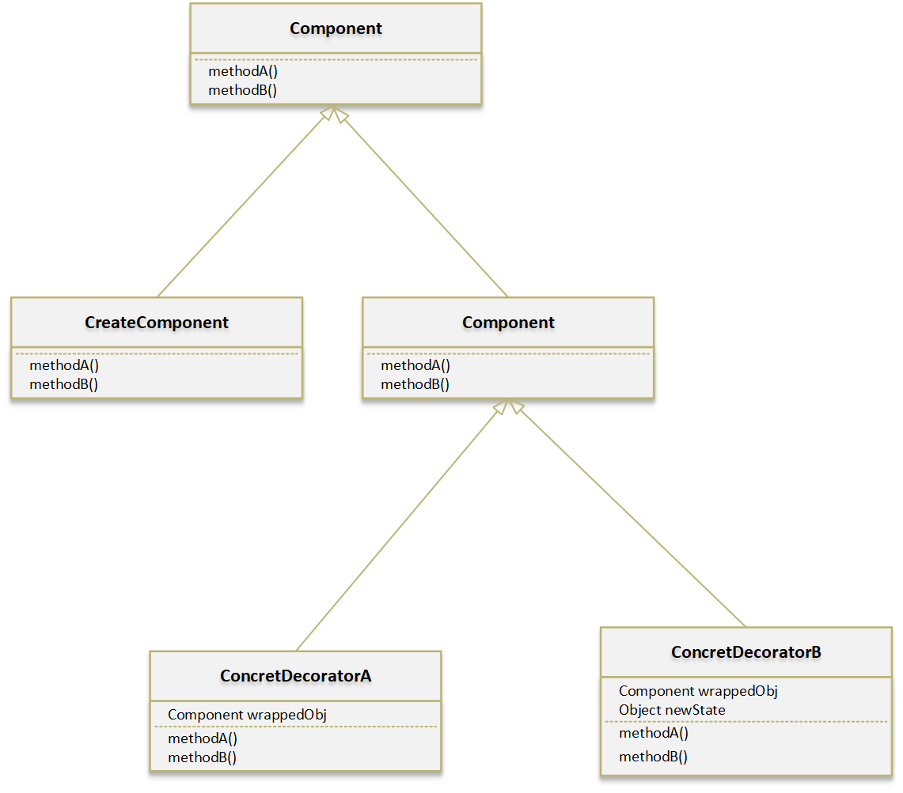

# 装饰者模式

设计原则:

> 类应该**对拓展开放, 对修改关闭**

## 概念

装饰者模式动态的将责任附加到对象上, 若要拓展功能, 装饰者提供了比继承更有弹性的替代方案

装饰者和被装饰的对象具有相同的超类, *可以用n个装饰者包装一个对象*, 装饰者可以在所委托被装饰者的行为之前/后, 加上自己的行为已达到特定的目的

## 类图

- 装饰者和被装饰的对象具有相同的超类: 利用继承的原因-----**类型匹配**, 而不是利用继承获得行为