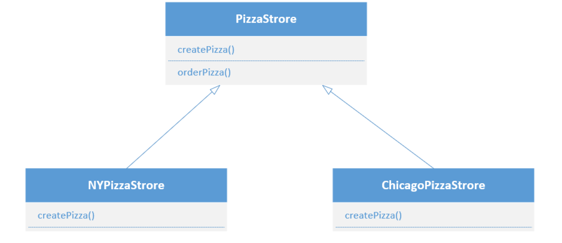
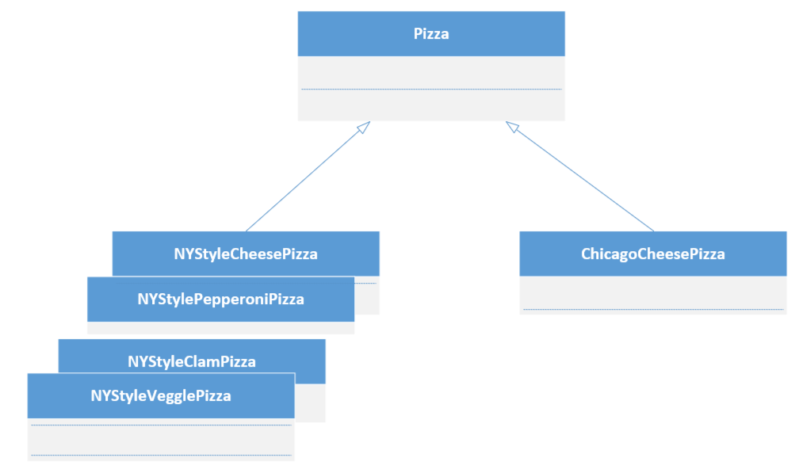
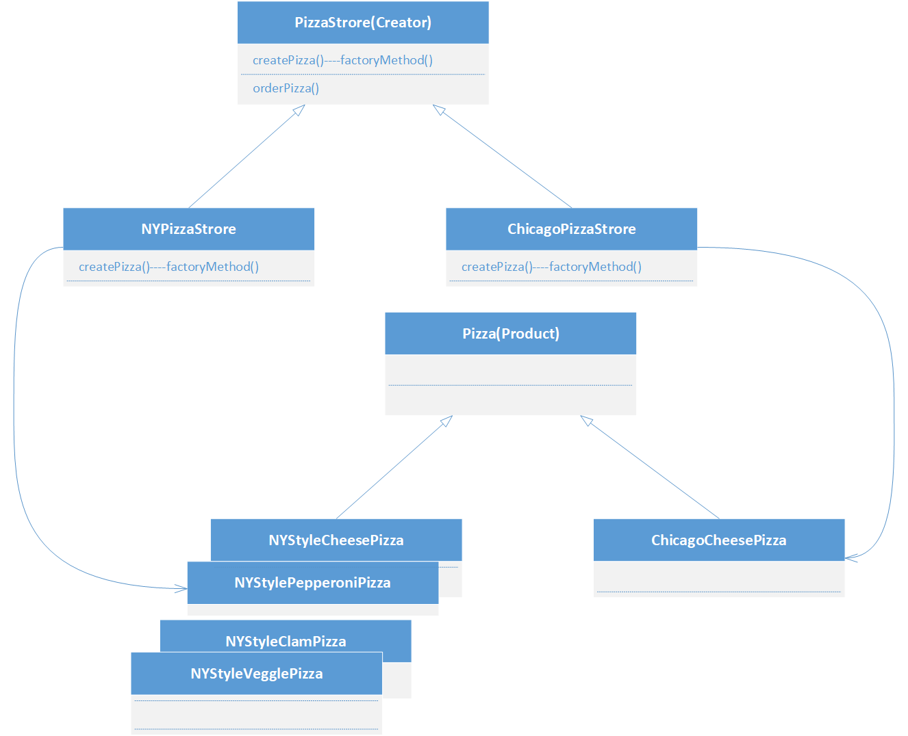
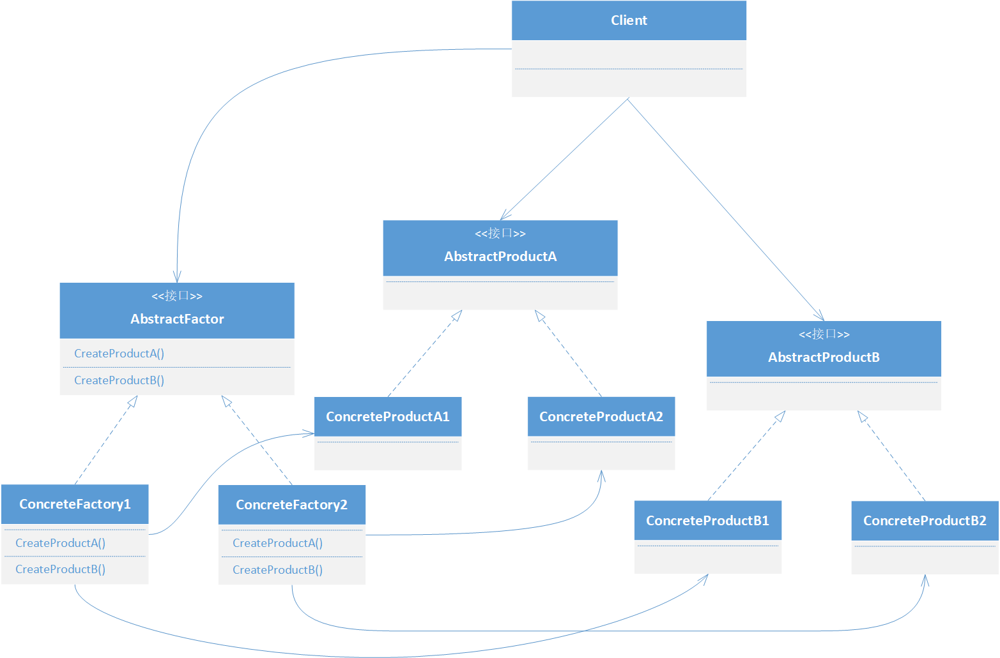

# 工厂模式

## 含义

定义了一个创建对象的接口, 但由子类决定要实例化的类是哪一个, **工厂方法让类把实例化推迟到子类**


旨在提供一种统一的方式**创建对象**, 将对象的实例化过程封装在一个单独的类中, 通过定义一个公共的接口创建对象, 也允许子类决定实例化哪个类

这样可以将创建对象与客户端的代码的耦合度降低到最低

## 工厂方法

```java
abstract Product factoryMethod(String type)
```

- `abstract`: 工厂一类子类处理对象的创建
- `Product`: 工厂方法需要返回一个产品

## 类图

两个类层级是平行的, 工厂视为一个框架, 工厂方法将**生产知识封装**进各个创建者

### 创建者类

定义抽象工厂方法, 让子类实现此方法制造产品



### 产品类

工厂生产的产品



### 整体来看



## 设计原则

> **依赖倒置原则**:(Dependency Inversion Principle)
>
> 要依赖**抽象**, 不要依赖具体类

说明不能让高层组件依赖底层组件, 而且不管高层底层组件, 都应该依赖于抽象

倒置的体现: 原本依赖的关系是自上而下(即全是低级依赖高级), 但是此原则是低级组件和高级组件都在依赖抽象

### 遵循的方针

尽量达到而并非十分严格的遵守

- 变量不可以持有具体类的引用
- 不要让类派生自具体类: 如果这样做, 就会依赖具体类而不是抽象
- 不要覆盖基类中已经实现的方法: 基类中已实现的方法, 应该由所有的子类共享

# 抽象工厂模式

## 定义

提供一个用于创建相关或依赖的对象的家族, 而不需要明确的指定具体类, *客户并不关心实际产出的具体产品是什么*, 这样**客户可以从具体的产品中被解耦**

## 类图



可以看出, 客户只需要和抽象工厂打交道, 运行时将自动使用实例化工厂

**抽象工厂定义了生产产品的接口**, 即使用了**工厂方法**

## java中的`extends`和`implement`

- `extends` 用于类的继承, Java支持**单继承**

- `implements` 用于实现接口, Java支持**多实现**

  **接口**: 是一种特殊的抽象类，它*只包含方法的声明而不包含方法的实现*

  接口中的方法默认是 `public abstract` 的，因此在实现类中必须使用 `public` 修饰符

### 其他

一个类可以同时继承一个类并实现多个接口

```java
class Animal {
    void eat() {
        System.out.println("Animal is eating");
    }
}

interface Swimmable {
    void swim();
}

interface Flyable {
    void fly();
}

class Duck extends Animal implements Swimmable, Flyable {
    public void swim() {
        System.out.println("Duck is swimming");
    }

    public void fly() {
        System.out.println("Duck is flying");
    }
}

public class Main {
    public static void main(String[] args) {
        Duck duck = new Duck();
        duck.eat();  // 继承自Animal类
        duck.swim(); // 实现Swimmable接口
        duck.fly();  // 实现Flyable接口
    }
}
```


