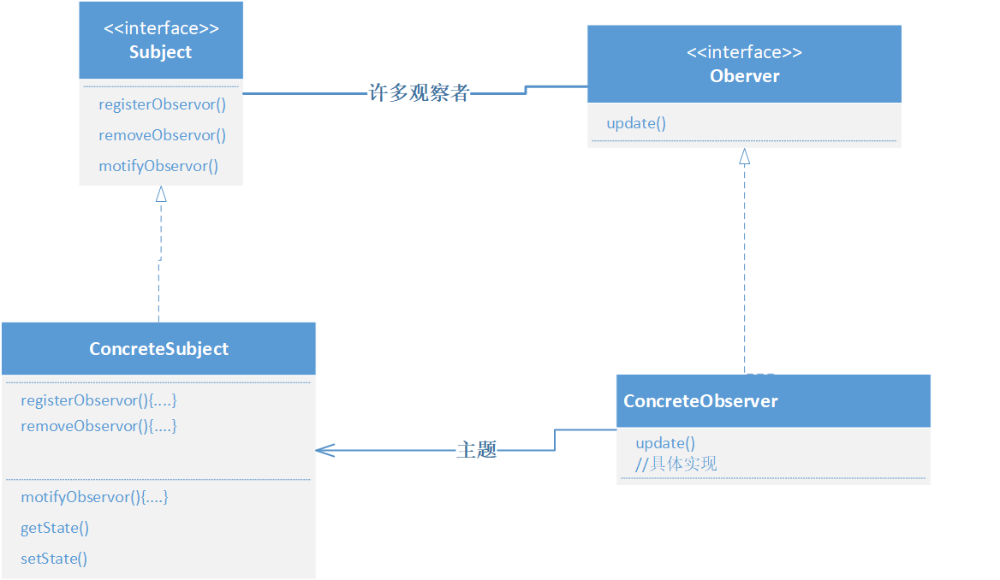

# Observer Pattern

**观察者模式=出版者+订阅者**

- 出版者: 主题
- 订阅者: 观察者

主题的数据改变时, 新的数据就会传送到观察者, 观察者可以自动接受来自主题的更新, 实现了主题和观察者之间的**松耦合**, 随时更改观察者对主题不会有影响, 所以只要两者之间的接口被遵守, 就可以自由变动双方, 满足的设计原则是:

> 为了交互对象之间的松耦合设计而努力

## 概念

定义了对象之间的**一对多依赖**, 当一个对象状态改变时, 它的所有依赖者都会收到通知并自动更新

类图:

因为主题是真正拥有数据的人, 仅让主题对数据进行控制可以避免让多对象控制同一个数据

## java内置的观察者模型

通过 `java.util.Observable` 类和 `java.util.Observer` 接口来实现, 这个模型允许对象（观察者）监听另一个对象（被观察者）的状态变化，并在状态变化时自动收到通知。

### `Observable`类

`Observable` 类是被观察者的基类。它维护了一个观察者列表，并提供了方法来添加、删除观察者，以及在状态变化时通知观察者。

方法:

- `addObserver(Observer o)`：添加一个观察者。
- `deleteObserver(Observer o)`：删除一个观察者。
- `notifyObservers()`：通知所有观察者，调用它们的 `update` 方法。
- `notifyObservers(Object arg)`：通知所有观察者，并传递一个参数。
- `setChanged()`：标记被观察者对象的状态已经改变。
- `clearChanged()`：清除被观察者对象的状态改变标记。
- `hasChanged()`：检查被观察者对象的状态是否已经改变。

### `Observer` 接口

`Observer` 接口是观察者的接口，它定义了一个 `update` 方法，当被观察者状态变化时，这个方法会被调用。

- `update(Observable o, Object arg)`：当被观察者状态变化时，这个方法会被调用。`o` 是被观察者对象，`arg` 是传递给观察者的参数。

## 其他

写c++版本时出了点小错误, 用gdb调试cmake项目, 刚开始尝试写`launch.json`后来放弃了, 用cmake插件自带的debug就可以, 真是简单快捷
