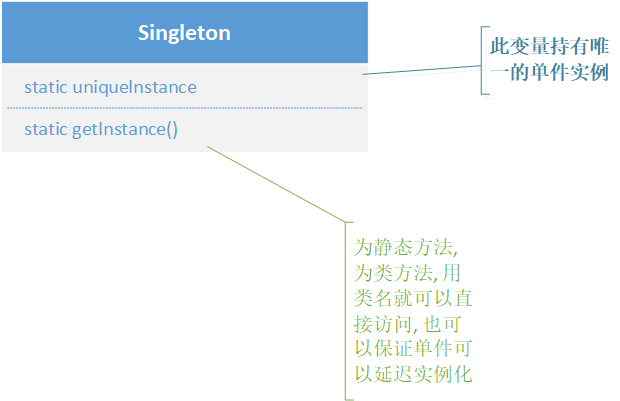

# 单件模式

用来创建独一无二的, 只能有一个实例对象的入场券

## 含义

确保**一个类中只有一个实例**, 并提供**一个全局的访问点**(java中的全局变量基本上就是对对象的静态引用)


## 类图



## 使用场景

确保程序中使用的全局资源只有一份, 管理共享的资源

- 注册表设置
- 数据库连接
- 线程池


## 其他

### java中的`static`

与c++类似, `static`成员属于类本身, 而不属于类的某个实例, 即无论创造多少个类的实例, `static`成员在内存中只有一份副本, 并可以通过类名直接访问

- 静态变量: 用于表示与类相关的全局状态

- 静态方法: 不用创建类的实例, 通过类名即可调用, 且静态方法不能访问非静态成员(变量或方法)

- 静态代码块: 在类加载时执行，并且只执行一次, **用于初始化静态变量或执行一些只需要执行一次的操作**

  ```java
  class MyClass {
      static int value;
  
      static {
          value = 10;  // 静态代码块，类加载时执行
          System.out.println("Static block executed.");
      }
  }
  
  public class Main {
      public static void main(String[] args) {
          System.out.println(MyClass.value);  // 输出 10
      }
  }
  ```


### java中的`synchronized`

可以确保在同一时刻，只有一个线程可以执行被 synchronized 修饰的方法或代码块，从而避免多个线程同时访问共享资源时产生的数据不一致问题

